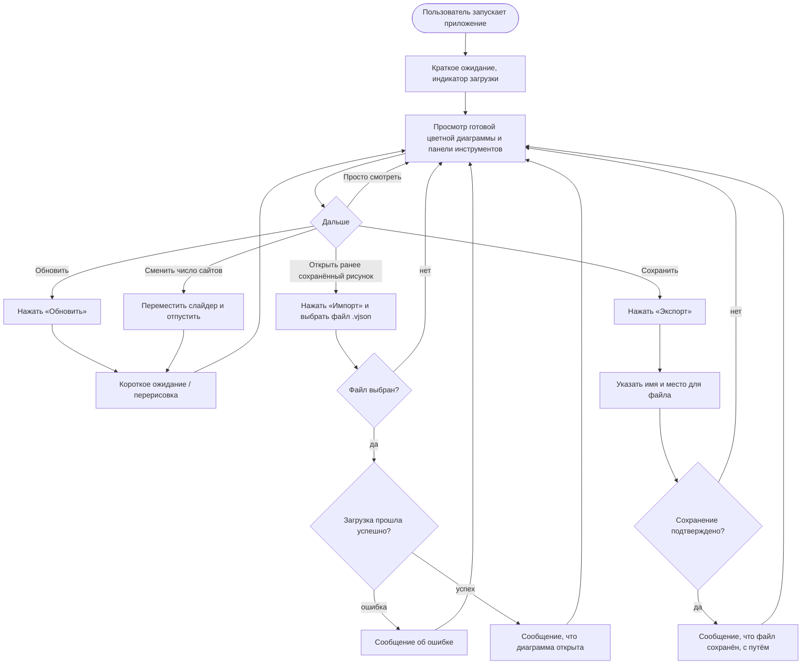

# Диаграмма активности: диаграмма Вороного (с точки зрения пользователя)

Показано, что делает пользователь и что при этом происходит в интерфейсе — без внутренних шагов программы.

В файл экспорта попадает описание текущей диаграммы (точки и размер «холста»). При открытии такого файла картинка снова строится в приложении.
